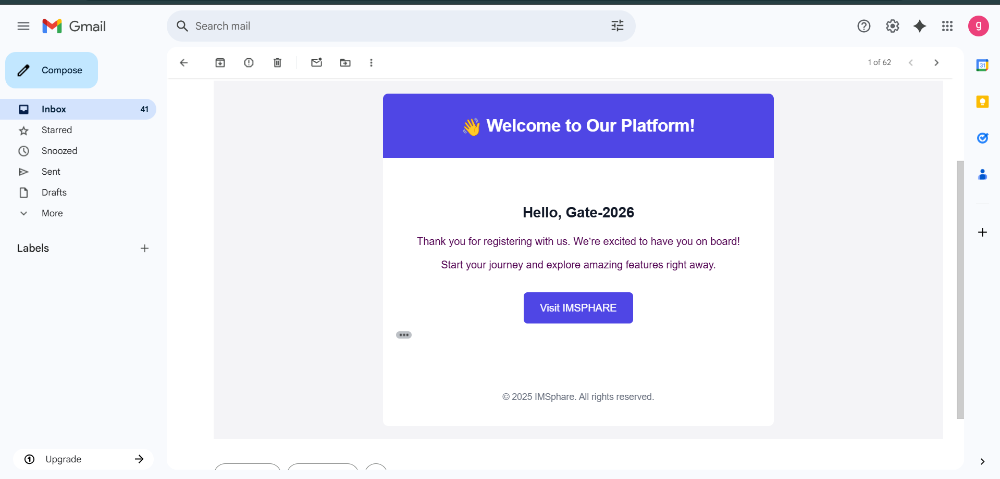

# 🌐 IMSphare 


## 📖 About the Project

<b>This project is a Portfolio Builder Website designed to help individuals create and showcase their professional portfolios easily.</b>

### Example:

This is a modern Portfolio Website Builder that allows users to create and share their professional portfolio with ease. Built with Laravel and React, it ensures speed, security, and flexibility.

## ✨ Features
🔐 User Authentication (Register, Login, Logout)  
📧 Welcome & Password Reset Email  

<div style="display: flex;flex-direction: column; grid-gap: 10px;">
   <div style="display: flex; grid-gap: 10px;">
        
        
    </div>
    </div>
<hr>

👤 User Profile with Social Links  
📂 CRUD operations (Projects, Skills, FAQ, etc.)  
📱 Fully Responsive Design  
⚡ Fast & SEO optimized  
🌙 Dark/Light Mode Support  
📊 Admin Dashboard for Management  
🛠️ Easy Customization & Scalability  
📸 Screenshots  
   - 🏠 Home Page  
   - 👤 User Profile  
   - 📧 Email Templates  
   - ⚙️ Admin Dashboard  
   - 🌙 Dark/Light Mode Preview 


## 🛠️ Tech Stack

Frontend: HTML, CSS, JavaScript, Bootstrap/Tailwind

Backend: Laravel

Database: MySQL

Authentication: Custom Auth / Google / Github

Deployment: Hostinger

## ⚙️ Installation
### Clone repository

  git clone sh ```https://github.com/coodig/im-sphare.git```

### Go to project directory

```sh
cd imsphare
```

### Install dependencies

```sh
composer install
npm install
```

### Setup environment

```sh
cp .env.example .env
php artisan key:generate
```

### Run migrations

```sh
php artisan migrate
```

### Start local server
```sh
php artisan serve
```
## 📧 Email Features

- Welcome Email – Sent after registration.
- Reset Password Email – Secure reset link with expiry.
- Templates built using Laravel Markdown Mailables.

## 🚀 Deployment

- Push code to GitHub/GitLab.
- Configure hosting (Hostinger / DigitalOcean / AWS).
- Setup .env for production database + mail configuration.
- Run migrations and seeders.

## 📜 License

### This project is licensed under the MIT License.

🤝 Contributing

- Fork the repository
- Create a feature branch (git checkout -b feature-name)
- Commit changes (git commit -m 'Added new feature')
- Push branch (git push origin feature-name)
- Create a Pull Request

## 👨‍💻 Author

## Sphare Co.

- 🌐 Portfolio: yourwebsite.com
- 💼 LinkedIn: Your LinkedIn
- 🐦 Twitter: @yourhandle


<h2 style="color:red">Currently in Under Development Stage...</h2>


<p style='text-align=center'>&copy 2025 <a href="https://imsphare.oranbyte.com"> IMSphare</a> | Designed by Sphare Co.</p>
